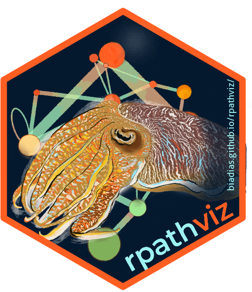

# rpathviz  

<!-- badges: start -->
  [](https://github.com/biadias/rpathviz/actions/workflows/R-CMD-check.yaml)
  [](https://app.codecov.io/gh/biadias/rpathviz)
  <!-- badges: end -->


Vizualizations for the Rpath package.


## Installation

To install the package and build all of the vignettes locally

```
remotes::install_github("biadias/rpathviz", build_vignettes=TRUE)
```

If you experience issues installing the package using `remotes` or don't need the vignettes locally then please use this alternative

```
pak::pak("biadias/rpathviz")
```


```

# Build the GOA 
GOA.obj <- rpath(Ecosense.GOA, eco.name = "Gulf of Alaska")

```

```
GOA.plot <- webplotviz(
  GOA.obj,
  h_spacing     = 3,
  text_size     = 2.5,
  node_size_min = 2,
  node_size_max = 30
)

```


Figure 1. Gulf of Alaska marine food web. 


### For Rpath description and methods:
Lucey, S. M.,  Gaichas, S. K., & Aydin, K. Y. (2020). 
Conducting reproducible ecosystem modeling using the open source mass balance model Rpath. 
Ecological Modelling 427(2020), 109057. 
https://doi.org/10.1016/j.ecolmodel.2020.109057.
